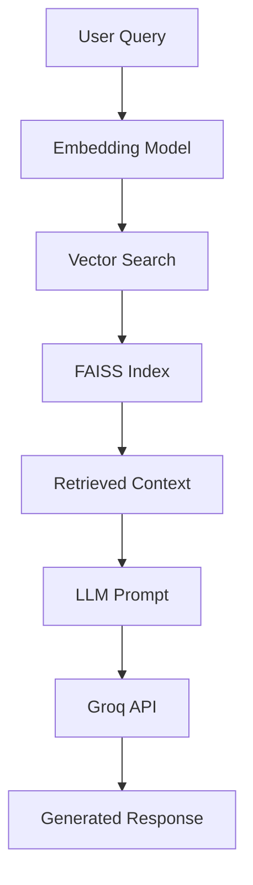

# 🛍 RAG Shop Bot

A web-based Retrieval-Augmented Generation (RAG) chatbot for e-commerce FAQs and product info. Features **dual implementations** - custom RAG and LangChain-powered RAG - using **Groq API** with LLaMA-3.1 models for generating natural and contextual answers.

---

## ✨ Features

- 🔍 **Vector-based semantic search** with **FAISS** and sentence transformers
- 🤖 **LLM-powered responses** using **Groq API** (llama-3.1-8b-instant)
- 🎯 **Dual implementations**: Custom RAG + LangChain RAG
- 💬 **Interactive Streamlit** chat interface with debug capabilities
- 🔒 **Secure architecture**: API keys in `.env`, production-ready structure
- 📊 **384-dimensional embeddings** for semantic understanding

---

## 🛠️ Tech Stack

- **Python 3.12+** - Core language
- **Streamlit** - Interactive web UI
- **FAISS** - Vector similarity search (Meta AI)
- **SentenceTransformers** - Text embeddings (`all-MiniLM-L6-v2`)
- **Groq API** - LLM inference (llama-3.1-8b-instant)
- **LangChain** - RAG framework and orchestration ✨
- **python-dotenv** - Environment variable management

---

## 🚀 Getting Started

### Prerequisites
- Python 3.12+ installed
- Groq API key (free tier available at [console.groq.com](https://console.groq.com/))

### Installation

1. **Clone the repository:**
    ```bash
    git clone https://github.com/liowjiaxin/rag-shop-bot.git
    cd rag-shop-bot
    ```

2. **Install dependencies:**
    ```bash
    pip install -r requirements.txt
    ```

3. **Configure environment:**
    Create a `.env` file in the project root:
    ```env
    GROQ_API_KEY=your_groq_api_key_here
    ```

4. **Launch the application:**
    
    **🔧 Custom RAG Implementation:**
    ```bash
    python -m streamlit run app/ui_streamlit.py
    ```
    
    **🦜 LangChain RAG Implementation (Recommended):**
    ```bash
    python -m streamlit run app/ui_streamlit_langchain.py
    ```

### 🎯 Quick Test
Visit `http://localhost:8501` and ask: *"What is your return policy?"*

---

## 💬 Example Queries

| Question | Expected Response |
|----------|-------------------|
| *"What is the return policy?"* | "You can return any item within 14 days of delivery." |
| *"Tell me about Wireless Headphones"* | Detailed product information with features and pricing |
| *"Do you offer free shipping?"* | Shipping policy details from the knowledge base |
| *"What brands do you carry?"* | List of available brands from product catalog |

---

## 🔄 Implementation Comparison

| Feature | Custom RAG | LangChain RAG |
|---------|------------|---------------|
| **Performance** | ⚡ Faster startup | 🔧 Feature-rich |
| **Debugging** | Basic error handling | 🐛 Advanced inspection |
| **Extensibility** | Manual implementation | 🚀 Ecosystem integration |
| **Use Case** | Production speed | Development & scaling |

---

## 🏗️ Architecture



### 📊 Vector Embeddings Flow:
1. **Documents** → SentenceTransformer → **384D Vectors** → **FAISS Index**
2. **User Query** → SentenceTransformer → **Query Vector** → **Similarity Search**
3. **Top-K Results** → **Context** → **LLM** → **Final Answer**

---

## 🌟 Key Benefits

- ✅ **Semantic Understanding** - Goes beyond keyword matching
- ✅ **Contextual Responses** - Grounded in your specific data
- ✅ **Scalable Architecture** - Handles thousands of documents
- ✅ **Dual Options** - Choose between speed vs features
- ✅ **Production Ready** - Secure, modular, and maintainable

---

## 🔮 Future Enhancements

- 🖼️ **Multi-modal search** with product image embeddings
- 🌍 **Multilingual support** (English, Malay, Chinese)
- 🔄 **Streaming responses** for real-time interaction
- 📈 **Analytics dashboard** for query insights
- 🧠 **Conversation memory** for contextual follow-ups
- 🔍 **Hybrid search** combining vector + keyword search

---

## 📚 Documentation

- [LangChain Integration Guide](LANGCHAIN_INTEGRATION.md) - Detailed implementation comparison
- [Groq API Documentation](https://console.groq.com/docs/) - LLM provider details
- [FAISS Documentation](https://faiss.ai/) - Vector search library

---